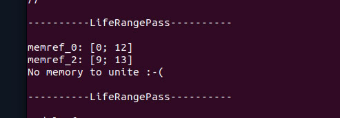

# 💥Dimas MLIR Utility💥
## Описание

Этот проект я написал в рамках своей интернатуры в **ИСП РАН**.
В нем я реализую **инструмент**, который используя возможности инфраструктуры MLIR выполняет анализ живых переменных и анализ псевдонимов. На основании результатов анализа он строит интервалы жизни переменных в удобном для чтения формате.
В этой статье я постараюсь доступно описать процесс создания этой утилиты.


## Первые шаги

Первое с чего следует стоить начать работу, это клонировать проект [llvm-project](https://github.com/llvm/llvm-project) и собрать его с включенным MLIR.

Полезные ссылки:
https://mlir.llvm.org/getting_started/
https://mlir.llvm.org/docs/

Рекомендация: чтобы легче отлаживать код, делайте **Debug** сборку. Так же можно собрать проект с опцией **BUILD_SHARED_LIBS** чтобы сборка содержала динамические библиотеки, это позволит сократить время сборки проекта и сократить использование дискового пространства.

## "Скелет" для mlir-opt утилиты

Начнем с организации структуры нашего проекта.
Сделаем это следующим образом:

```
/ (project root)
|-include
| |-LATool
| | |-Passes.td
| | |-CMakeLists.txt
| | |-Passes.h
| |-CMakeLists.txt
|
|-lib
| |-LATool
| | |-LifeRangePass.cpp
| | |-CMakeLists.txt
| |-CMakeLists.txt
|
|-tools
| |-LATool
| | |-lr-mlir-opt.cpp
| | |-CMakeLists.txt
| |-CMakeLists.txt
|
|-test
| |-*.mlir
|
|-CMakeLists.txt
```


При написании собственной утилиты, следует начать с ее "скелета" - самой простой версии. Условно назовем нашу утилиту **lr-mlir-opt**, которая будет содержать только один параметр, например **--liferange-analysis**, запускающий соответствующий **pass** (который на данном этапе условно выведет Hello MLIR World).

**Важное замечание**: очень удобно писать свой первый проект, основываясь на примере [Standalone](https://github.com/llvm/llvm-project/tree/main/mlir/examples/standalone) из MLIR Examples.
Там по структуре проекта очень просто понять, как регистрировать Pass, как писать его простейшую реализацию и как генерировать с помощью **CMake** и **tblgen** Passes.h.inc файл. Там же находится все для сборки проекта.

После написания простейшей реализации Pass'a и его регистрации в lr-mlir-opt утилите, попробуем решить нашу задачу для самого простого случая.

## Случай 1. Простейшие интервалы жизни.

Пример для этого случая:
```llvm
func.func @test0() {
  %alloc = memref.alloc() : memref<16xf16>
  %c1 = arith.constant 1 : index
  %c1_i32 = arith.constant 1 : i32
  %cst = arith.constant 1.000000e+01 : f16
  %alloc_0 = memref.alloc() : memref<10xi32>
  %1 = memref.load %alloc[%c1] : memref<16xf16>
  %2 = arith.addf %1, %cst : f16
  memref.store %2, %alloc[%c1] : memref<16xf16>
  memref.store %c1_i32, %alloc_0[%c1] : memref<10xi32>
  return
}
```

Есть класс **Liveness** из библиотеки **MLIR**, где есть много информации о переменных. Конкретно для этого случая, мы можем вытащить лишь информацию об интервалах жизни переменных и вывести ее в удобном формате.

Пример dump'а из Liveness Анализа (видно, что есть куча разной информации):
```
// ---- Liveness -----
// - Block: 0
// --- LiveIn: arg0@1 arg1@1
// --- LiveOut:
// --- BeginLivenessIntervals
// val_1 :
//     %alloc = memref.alloc() : memref<10xi32>
//     %c1_i32 = arith.constant 1 : i32
//     %cst = arith.constant 1.000000e+01 : f16
//     %c0 = arith.constant 0 : index
//     %c1 = arith.constant 1 : index
//     %c10 = arith.constant 10 : index
//     %0 = scf.for %arg1 = %c0 to %c10 step %c1 iter_args(%arg2 = %cst) -> (f16) {
  %1 = memref.load %arg0[%arg1] : memref<16xf16>
  memref.store %c1_i32, %alloc[%arg1] : memref<10xi32>
  %alloc_0 = memref.alloc() : memref<10xf16>
  %2 = arith.addf %1, %arg2 : f16
  memref.store %2, %alloc_0[%c1] : memref<10xf16>
  scf.yield %2 : f16
}
//     %1 = memref.load %arg0[%arg1] : memref<16xf16>
//     memref.store %c1_i32, %alloc[%arg1] : memref<10xi32>
```

Пример вывода нашего Pass'а:



## Случай 2. Циклы.

Пример для этого случая:
```llvm
// normal
func.func @test2(%input : memref<16xf16>) {
  %alloc = memref.alloc() : memref<10xi32>

  %c1_i32 = arith.constant 1 : i32
  %cst = arith.constant 1.000000e+01 : f16

  %c0 = arith.constant 0 : index
  %c1 = arith.constant 1 : index
  %c10 = arith.constant 10 : index
  %0 = scf.for %arg0 = %c0 to %c10 step %c1 iter_args(%arg1 = %cst) -> (f16) {
    %load = memref.load %input[%arg0] : memref<16xf16>
    memref.store %c1_i32, %alloc[%arg0] : memref<10xi32>

    %alloc_0 = memref.alloc() : memref<10xf16>

    %add = arith.addf %load, %arg1 : f16
    memref.store %add, %alloc_0[%c1] : memref<10xf16>

    scf.yield %add : f16
  }
  memref.store %0, %input[%c1] : memref<16xf16>
  return
}
```

В циклах есть особенность, так как последнее использование alloc расположены в цикле, в рамках задания мы считаем, что эта переменная *жива на протяжении всего цикла и будет мертва только в его конце*. Следовательно, нам нужно внести корректировки в подсчет интервалов жизни.

Внутри нашего Pass'a добавим отдельный ``` if (isa<scf::ForOp>(op)) ```, где мы и внесем изменения в интервал жизни, доопределив конец жизни переменной, концом блока (```op.getRegions().back().back();```).


## Случай 3. Анализ Псевдонимов

```llvm
/// hard (AliasAnalysis)
func.func @test3() {
  %alloc = memref.alloc() : memref<16xf16>
  %c0 = arith.constant 0 : index
  %c1 = arith.constant 1 : index
  %c1_i32 = arith.constant 1 : i32
  %c10 = arith.constant 10 : index
  %cst = arith.constant 1.000000e+01 : f16
  %0 = scf.for %arg0 = %c0 to %c10 step %c1 iter_args(%arg1 = %alloc) -> (memref<16xf16>) {
    memref.store %cst, %arg1[%arg0] : memref<16xf16>
    scf.yield %arg1 : memref<16xf16>
  }
  %alloc_0 = memref.alloc() : memref<10xi32>
  %1 = memref.load %0[%c1] : memref<16xf16>
  %2 = arith.addf %1, %cst : f16
  memref.store %2, %0[%c1] : memref<16xf16>
  memref.store %c1_i32, %alloc_0[%c1] : memref<10xi32>
  return
}
```

Это самый сложный случай - анализ псевдонимов (**Alias Analysis**)).
Тонкость этого случая, заключается в том, что у нас есть несколько указателей, указывающих на один и тот же блок памяти. В **Liveness Analysis**'е нет информации о том, является ли переменная псевдонимом или нет, поэтому нам надо прибегнуть к еще одному инструменту.

**Alias Analysis** - это анализ во MLIR, который позволяет достать информацию о том, является ли переменная псевдонимом или нет.
Реализуем дополнительную проверку, которая объединяет интервалы жизни всех псевдонимов, указывающих на одни и те же данные. **Profit!!!**.


💘 **Dmit DREC MIPT 2024**
